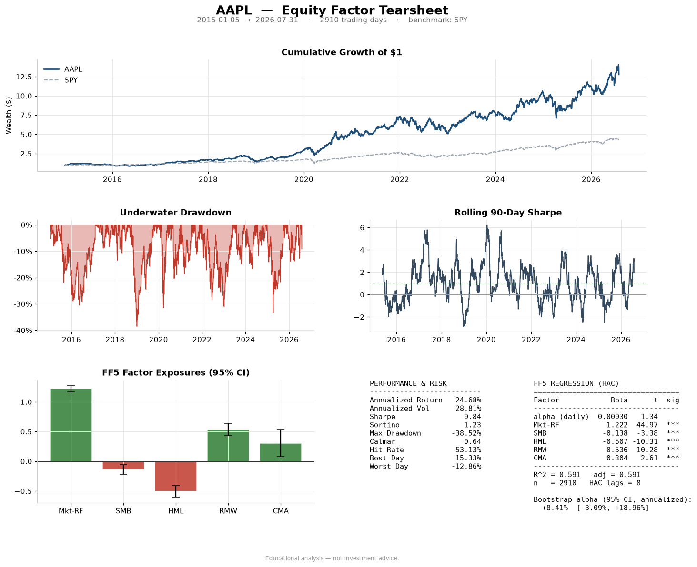

# Equity Factor Tearsheet

A factor attribution tearsheet for any Yahoo ticker.

The question it answers: is this stock or fund earning excess return, or
renting factor exposure you could buy for three basis points?



## Result

Four names, 2015-01-05 to 2026-07-31, 2,910 trading days:

| Ticker | Ann. return | FF5 alpha | Alpha t | Mkt beta | R^2 |
|--------|------------:|----------:|--------:|---------:|-----:|
| AAPL   |      24.68% |    +7.53% |   +1.34 |     1.22 | 0.59 |
| KO     |       9.92% |    +0.66% |   +0.15 |     0.59 | 0.36 |
| ARKK   |      12.54% |    +4.54% |   +1.02 |     1.28 | 0.81 |
| BRK-B  |      11.26% |    -0.22% |   -0.07 |     0.83 | 0.68 |

Not one t-stat clears 1.96. AAPL's +7.53% carries a bootstrap 95% interval from
-3.09% to +18.96%, so even its sign is unsettled. What it pins down is exposure:
market beta 1.22 at t = 45, RMW +0.54 and HML -0.51 both above 10. The 24.68% a
year is real; the evidence that it came from anything else is not.

This is a diagnostic, not a strategy: whether a return stream is explained by
known factors, not what to buy.

## Limitations

Betas are full-sample averages. Real exposures drift.

Ken French publishes with a lag, so the window stops several weeks short of
today. This run ends 2026-07-31.

Prices are split and dividend adjusted. Names that no longer trade are not in
the sample.

Alpha is annualized at x252, not compounded: 7.53% against 7.82% for AAPL.

No multiple testing correction. Screen enough names and some clear 1.96 by
chance.

## Method

Daily simple returns minus the Ken French RF, inner joined to the factor
calendar, never forward filled.

OLS on FF3 and FF5 with Newey-West errors at floor(4(n/100)^(2/9)) lags, 8 at
n = 2,910.

Moving block bootstrap on alpha, 1,000 resamples of length-5 blocks, for an
interval that does not assume normality. Bootstrap mean +8.41%, OLS +7.53%.

Section 10 fits the engine to synthetic data with alpha 0.0005/day and market
beta 1.10 and asserts recovery before section 11 touches live prices: market beta
within 0.06, alpha within 0.00015, bootstrap CI covering the true alpha. It
returns 1.096 and 0.00051.

## Running it

```bash
pip install -r requirements.txt
```

Open `Equity_Factor_Tearsheet.ipynb`, run all cells, then edit the ticker in
section 11.

```python
result = generate_tearsheet("AAPL")
comparison = compare(["AAPL", "KO", "ARKK", "BRK-B"])
```

## Repo contents

| Path | Contents |
|------|----------|
| `Equity_Factor_Tearsheet.ipynb` | Sections 1-9 build the engine, 10 validates it, 11 runs it, 12 reads the output back |
| `requirements.txt` | Dependencies, including jinja2 for the styled `compare()` table |
| `figures/aapl_tearsheet.png` | The figure above, cell 22 output |

## References

Fama, E. and French, K. (1993). Common risk factors in the returns on stocks
and bonds. Journal of Financial Economics 33(1), 3-56.

Fama, E. and French, K. (2015). A five-factor asset pricing model. Journal of
Financial Economics 116(1), 1-22.

Newey, W. and West, K. (1987). A simple, positive semi-definite,
heteroskedasticity and autocorrelation consistent covariance matrix.
Econometrica 55(3), 703-708.

Ken French Data Library:
https://mba.tuck.dartmouth.edu/pages/faculty/ken.french/data_library.html

Concepts and method explained in `docs/methodology.md`.